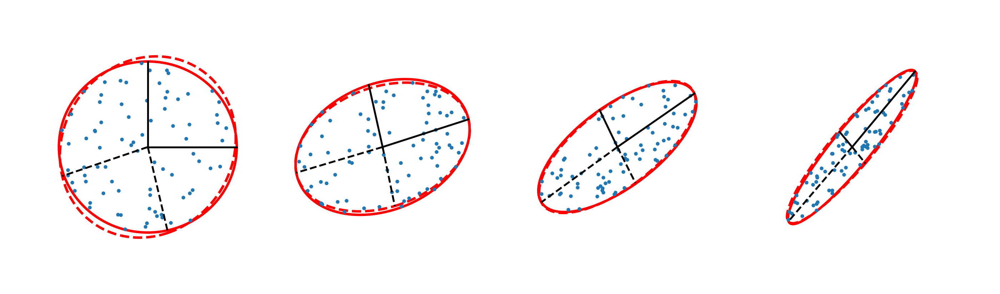

# Intertia Tensors

This package contains functions calculate inertia tensors given collections of n-dimensional points.


## Description

This package contains tools to calculate:

* standard inertia tensor,
* reduced inertia tensor,
* and the ierative reduced inertia tensor.


## Requirements

In order to use the functions in this package, you will need the following python packages installed:

* numpy
* astropy


## Installation

Place this directory in your PYTHONPATH.  The various functions can then be imported as, e.g.:  

```
from inertia_tensors import inertia_tensors
```  


contact:
duncanc@andrew.cmu.edu